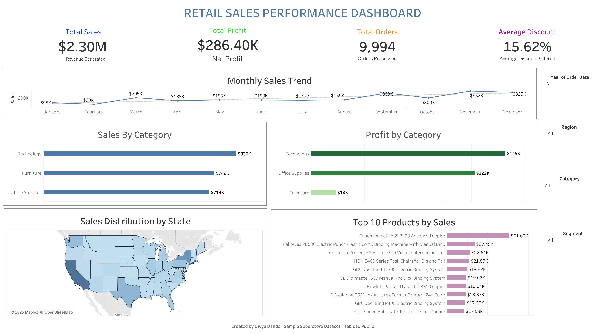

# Retail-Sales-Performance-Dashboard

An interactive Tableau dashboard built using the Sample Superstore dataset to analyze sales, profit, orders, and discounts across different business dimensions.

---

## 📊 Dashboard Preview

---

## 🚀 Project Overview

This dashboard provides a comprehensive view of retail sales performance and enables users to explore key business metrics through interactive filters.

### Key KPIs
- Total Sales
- Total Profit
- Total Orders
- Average Discount

### Dashboard Features
- Monthly Sales Trend
- Sales by Category
- Profit by Category
- Sales Distribution by State
- Top 10 Products by Sales
- Interactive Filters (Year, Region, Category, Segment)

---

## 🛠 Tools Used

- Tableau Public
- Sample Superstore Dataset
- Data Visualization
- Dashboard Design

---

## 📂 Files Included

| File | Description |
|------|-------------|
| Retail_Sales_Dashboard.twbx | Tableau Workbook |
| Sample_Superstore.csv | Dataset |
| dashboard.png | Dashboard Screenshot |

---

## 🎯 Business Insights

- Technology generated the highest sales.
- Technology was the most profitable category.
- California contributed the highest sales among all states.
- Sales showed strong growth during September, November, and December.
- A small number of products contributed significantly to overall sales.

---

## 🔗 Tableau Public

Add your Tableau Public dashboard link here:

https://public.tableau.com/app/profile/your-profile

---

## 👩‍💻 Author

**Divya Dande**

GitHub: https://github.com/Dandedivya
